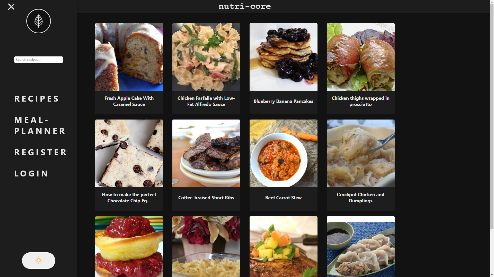
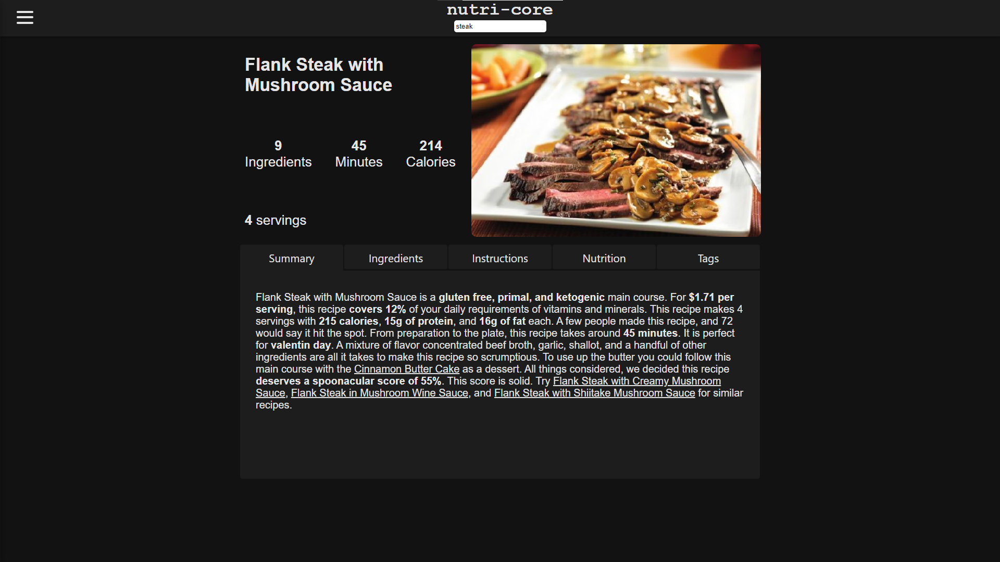

# Nutrition

## What is it?

On this website you are going to be able to choose from tons of recipes & ingredients for your daily needs of food.
Create meal plans for a whole week, with 3 or more foods per day seeing their nutrients (protein, fat, carbs etc.) !
If you are done with your plan, create your shopping list for collecting the materials you need for the meals.

### Implemented:

- Random recipes
- Single page for recipes
- Summary tab
- Ingredients tab
- Nutrition tab
- Tags tab
- Registration & Login
- Generate meal plan by given properties

### Currently working on:

- Create custom meal plans
- Save them in our database

## Technologies: 

- PostgresSQL
- Spring Boot
- Spring Boot Security
- JWT token

## API
The Api which inspired this website : [SpoonacularAPI](https://spoonacular.com/food-api)
